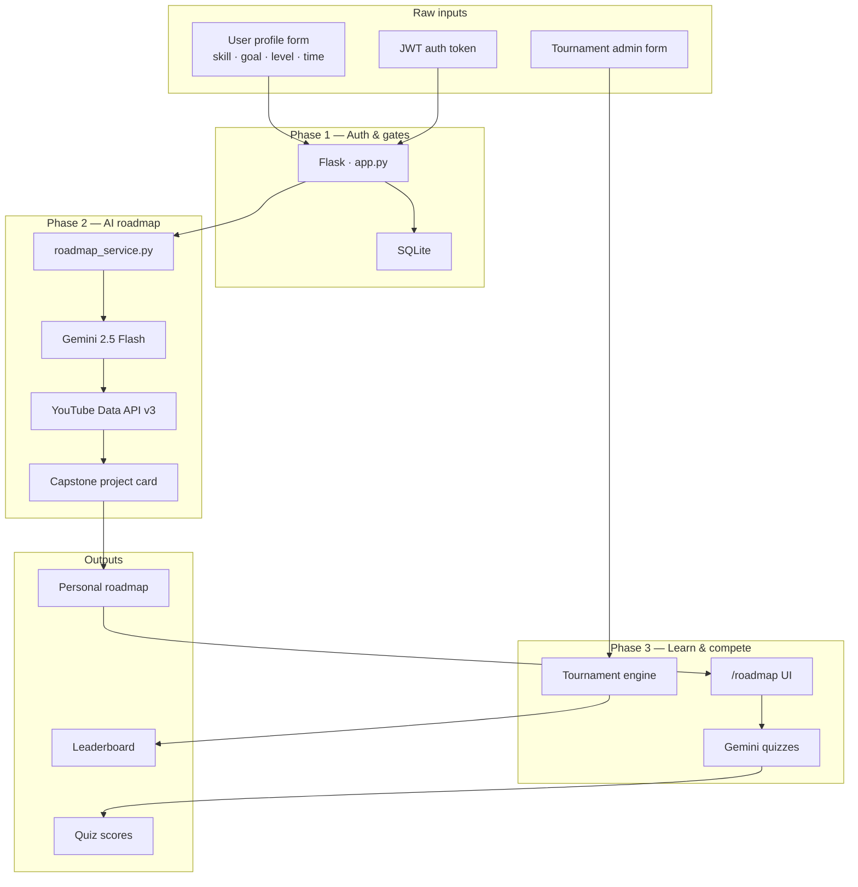

# KnowledgeWar

**AI-powered personalized learning platform with daily tournaments** — built and battle-tested for [TestSprite Hackathon Season 3](https://www.testsprite.com).

| | |
|---|---|
| **Live app** | https://testsprite-hackathonseason3-knowledgewar-xk2p.onrender.com |
| **TestSprite dashboard** | https://www.testsprite.com/dashboard/tests/1839c68e-2f6e-497e-a25f-7c9b798a7c1a |
| **Verification log** | [`LOOP.md`](LOOP.md) |
| **Test evidence** | [`.testsprite/manifest-all.json`](.testsprite/manifest-all.json) |

---

## Team — TestSprite Hackathon Season 3

This project was designed, built, deployed, and **fully verified** over **6 TestSprite iterations** — from zero to a live Render app with **36 automated tests** and a documented **Write → Verify → Fix → Verify** loop.

Huge respect and sincere thanks — we built this hackathon project **together**: late-night CI runs, false-BLOCKED triage, Gemini pipeline refactors, and keeping every iteration honest in [`LOOP.md`](LOOP.md).

| Name | Email | GitHub |
|------|-------|--------|
| **Mahmut Kerem Erden** | k.erden03@gmail.com | [@Kerden22](https://github.com/Kerden22) |
| **Yiğit Temel** | yigit.temel61@gmail.com | [@plendroik](https://github.com/plendroik) |

> **Thank you** to the TestSprite team for hosting Hackathon Season 3 and for a CLI + portal that let us ship with real browser and API verification against production — not just unit mocks.

---

## TestSprite — Verification at a Glance

> **This repo is a TestSprite hackathon submission first.** The app exists; the proof is in the suite.

### Scorecard

| Metric | Value |
|--------|-------|
| TestSprite project ID | `1839c68e-2f6e-497e-a25f-7c9b798a7c1a` |
| Frontend plans | **25** (`testsprite-plans/01`–`25`) |
| Backend API scripts | **11** (`testsprite/tests/*.py`) |
| **Unique tests** | **36** |
| Banked PASS | **28** |
| Waived BLOCKED (false positive) | **8** — app works; agent wrote summary instead of formal PASS |
| FAILED (fixed) | **1** — hash-URL i18n (`ebe0b04d`) |
| **Open bugs** | **None** |
| Iteration 6 functional score | **14/14** |

### How we tested (Write → Verify → Fix → Verify)

| Role | Tool |
|------|------|
| **Maker** | Cursor — feature code, refactors, fixes |
| **Checker** | [TestSprite CLI](https://www.testsprite.com) — live Render URL, real browser + `requests` assertions |

Every sprint is logged in **[`LOOP.md`](LOOP.md)** with: *why* we ran that iteration, what changed, per-test PASS/FAIL/BLOCKED, root-cause write-ups, and waived false BLOCKED entries.

| Iteration | Date | Focus | Functional |
|-----------|------|-------|------------|
| 2 | 2026-07-02 | Guest nav, i18n, login/register | **6/6** |
| 3 | 2026-07-03 | Auth gates, logged-in nav, hash i18n bug found & fixed | **6/6** |
| 4 | 2026-07-03 | Roadmap + Test pages | **5/5** |
| 5 | 2026-07-04 | Tournament, Profile, Learn, Admin | **6/6** |
| 6 | 2026-07-05 | **Gemini + YouTube roadmap refactor** + full FE/BE CI | **14/14** |

### Test assets in this repo

```
testsprite-plans/     ← 25 FE JSON plans (browser flows)
testsprite/tests/     ← 11 BE Python scripts (API contracts)
.testsprite/          ← Hackathon evidence for jury
├── manifest-all.json ← START HERE — full suite index
├── pass/manifest.json
├── blocked/manifest.json
└── failure/manifest.json
```

> **Hackathon form:** *Does your repository contain a `.testsprite/failure/` subfolder?*  
> **Yes** — plus `pass/` and `blocked/`. See [`manifest-all.json`](.testsprite/manifest-all.json).

```bash
# Re-download a run bundle
testsprite test artifact get <runId> --out ./.testsprite/blocked/<test-name>
```

### CI workflow

File: [`.github/workflows/testsprite.yml`](.github/workflows/testsprite.yml)

| Setting | Value |
|---------|-------|
| Trigger | **Manual only** (`workflow_dispatch`) — push does not burn credits |
| Default run | **14 tests** — 3 FE → 11 BE |
| Live target | Render URL (workflow wakes app before run) |

**Run:** GitHub → Actions → **TestSprite CI/CD Verification** → Run workflow

| Input | Default | What runs |
|-------|---------|-----------|
| `run_frontend` | `true` | `a4bd6c04` learn smoke · `eca16881` roadmap smoke · `a4732506` learn form |
| `run_backend` | `true` | Auth, validation, tournaments, courses, **full Gemini+YouTube pipeline** (`a7bbf927`, `f046f210` last) |

Details and test IDs: [`testsprite/README.md`](testsprite/README.md) · [`.testsprite/README.md`](.testsprite/README.md)

### Bugs caught by TestSprite (real, fixed)

| Test ID | Bug | Fix |
|---------|-----|-----|
| `ebe0b04d` | TR toggle ignored on `/#how-it-works` | `setLang()` → `location.reload()` when hash-only change | `static/i18n.js` |
| Iter 3 gates | Guest could open `/roadmap` | Token check → `/login` | `templates/roadmap.html` |
| Iter 6 | `GEMINI_API_KEY` not loaded | `load_dotenv()` before imports | `app.py` |

---

## About the App

Tell the app what you want to learn — **Google Gemini** builds a step-by-step video roadmap enriched with **YouTube** lessons; practice with AI quizzes; compete in **daily tournaments** on a live leaderboard.

### User journey

1. **Sign up / log in** — JWT auth; SQLite (ephemeral on Render free tier; test user seeded each deploy).
2. **Create a path** (`/learn`) — skill, goal, level → Gemini steps + YouTube video per step.
3. **Preview & save** — thumbnails + watch links → persist roadmap.
4. **Follow** (`/roadmap`) — sequential steps; final **capstone project card**.
5. **Practice** (`/test`) — AI-generated questions.
6. **Compete** (`/tournament`, `/battle`) — countdown, leaderboard.
7. **Profile** — active/completed courses, tournament wins.
8. **Admin** (`/tournament-admin`) — create tournaments; Gemini generates questions.

### Product rules (enforced in code + TestSprite)

| Rule | Behavior |
|------|----------|
| Guests cannot access tournaments | No Tournaments nav; `/tournament` → `/login` |
| Guests cannot access profile or roadmap | `/profile`, `/roadmap` → `/login` |
| Logged-in users | Full nav: Roadmap + Tournaments |
| i18n | EN + TR on all major pages |

**Default test user** (Render): `k.erden03@gmail.com` / `123456`

---

## Architecture — Pipeline Flow



### Roadmap pipeline (Iteration 6)

```
POST /api/analyze-profile
  → generate_roadmap_with_gemini()     # gemini-2.5-flash, JSON steps
  → enrich_steps_with_youtube()        # parallel YouTube search, 🎬 per step
  → append_project_step()              # locked capstone card
  → { roadmap_title, roadmap_steps, total_steps }

POST /api/add-course-to-roadmap  →  SQLite  →  /roadmap
```

Legacy BTK/Selenium scraping was **removed** in Iteration 6.

---

## Tech Stack

| Layer | Technology |
|-------|------------|
| Backend | Python 3, Flask 3 |
| DB | SQLite |
| Auth | JWT (PyJWT) |
| AI | Gemini `gemini-2.5-flash` |
| Video | YouTube Data API v3 |
| Frontend | Jinja2, vanilla JS |
| i18n | `static/i18n.js`, `en.json`, `tr.json` |
| Deploy | Gunicorn, Render, `Procfile` |
| **Testing** | **TestSprite CLI** — 25 FE + 11 BE |
| **CI** | GitHub Actions `testsprite.yml` |

---

## Project Structure

```
├── app.py
├── services/roadmap_service.py
├── templates/              # index, learn, roadmap, test, tournament, …
├── static/i18n/
├── testsprite/tests/       # 11 BE scripts
├── testsprite-plans/       # 25 FE plans
├── .testsprite/            # manifests + artifacts
├── .github/workflows/testsprite.yml
├── LOOP.md                 # full verification log
└── Procfile
```

---

## Setup & Deploy

### Environment variables

```env
SECRET_KEY=...
GEMINI_API_KEY=...
YOUTUBE_API_KEY=...
```

| Variable | Required | Purpose |
|----------|----------|---------|
| `SECRET_KEY` | Prod | JWT |
| `GEMINI_API_KEY` | Yes | Roadmaps + questions |
| `YOUTUBE_API_KEY` | Yes | Video enrichment |

### Local run

```bash
git clone https://github.com/Kerden22/TestSprite_HackathonSeason3_KnowledgeWar.git
cd TestSprite_HackathonSeason3_KnowledgeWar
pip install -r requirements.txt
# create .env with keys above
python app.py
```

### Render

`Procfile`: `web: gunicorn app:app --bind 0.0.0.0:$PORT`

---

## Pages

| Page | Path | Auth |
|------|------|------|
| Home | `/` | Public |
| Login / Register | `/login` | Public |
| Learn | `/learn` | Yes |
| Roadmap | `/roadmap` | Yes |
| Test | `/test` | Yes |
| Tournament | `/tournament` | Yes |
| Battle | `/battle` | Yes |
| Profile | `/profile` | Yes |
| Tournament Admin | `/tournament-admin` | Yes |

---

## API Reference (selected)

<details>
<summary><strong>Auth</strong></summary>

| Method | Endpoint | Description |
|--------|----------|-------------|
| POST | `/api/register` | Create account |
| POST | `/api/login` | JWT token |
| GET | `/api/profile` | Profile (JWT) |

</details>

<details>
<summary><strong>Learning roadmap</strong></summary>

| Method | Endpoint | Description |
|--------|----------|-------------|
| POST | `/api/analyze-profile` | Gemini + YouTube roadmap |
| POST | `/api/add-course-to-roadmap` | Save roadmap |
| GET | `/api/get-user-roadmap` | Fetch roadmap |
| GET | `/api/active-course` | Active course |
| GET | `/api/completed-courses` | History |

</details>

<details>
<summary><strong>Tournaments</strong></summary>

| Method | Endpoint | Description |
|--------|----------|-------------|
| GET | `/api/tournaments` | List |
| POST | `/api/join-tournament` | Join |
| GET | `/api/leaderboard/<id>` | Standings |
| POST | `/api/save-tournament` | Admin create |
| POST | `/api/generate-questions` | AI questions |

</details>

---

## Links

| | |
|---|---|
| Kerem | https://github.com/Kerden22 |
| Yiğit | https://github.com/plendroik |
| Commits / evidence | https://github.com/Kerden22/TestSprite_HackathonSeason3_KnowledgeWar/commits/master |
| LOOP log | [`LOOP.md`](LOOP.md) |
| Test manifests | [`.testsprite/README.md`](.testsprite/README.md) |
